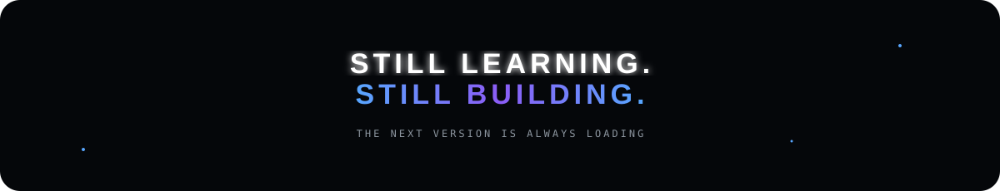

<div align="center">


<br>

<a href="https://github.com/mohitaggarwal10940-ui"></a>
<a href="https://codeforces.com/profile/mohitxspeaks"></a>

</div>

---

# ✦ WHO AM I?

I'm **Mohit**.

I love creating products, experimenting with software and turning random ideas into things that actually work.

Right now I'm learning **C++ + DSA**, exploring **app development**, and using **AI as a development multiplier**.

I learn by building.

```text
IDEA → RESEARCH → AI + CODE → BUILD → BREAK → DEBUG → SHIP
```

> **Still learning. Still building. Still figuring things out.**

---

<div align="center">

</div>

---

# 🚀 PROJECTS

<table>
<tr>
<td width="50%" valign="top">

## 🛡️ SATARK

**Financial Fraud Awareness**

An Android project exploring how software can help users identify potentially suspicious investment and financial content.

`Android` · `Kotlin` · `UI` · `AI-assisted development`

<a href="https://github.com/mohitaggarwal10940-ui/Satark"></a>

</td>
<td width="50%" valign="top">

## 👁️ NIGRANI

**Monitoring & Inspection**

A monitoring application involving inspections, alerts, surveillance, location verification and institutional workflows.

`Android` · `Jetpack Compose` · `Application Design`

<a href="https://github.com/mohitaggarwal10940-ui"></a>

</td>
</tr>
<tr>
<td width="50%" valign="top">

## 🍱 SMART FOOD

**Recommendation Experiment**

An earlier experiment around food recommendations and personalization.

`Python` · `Recommendation` · `Experimentation`

<a href="https://github.com/mohitaggarwal10940-ui/SMART-FOOD-RECOMMENDATION"></a>

</td>
<td width="50%" valign="top">

## 🧪 BUILD LAB

**Something is always cooking.**

Not every experiment becomes a polished project. Some become lessons. Some become the next thing.

`Ideas` · `AI` · `Experiments`

<a href="https://github.com/mohitaggarwal10940-ui"></a>

</td>
</tr>
</table>

---

# 🤖 AI × DEVELOPMENT

I use AI heavily while building — for research, debugging, prototyping, UI exploration, architecture, documentation and learning unfamiliar concepts.

Not to avoid learning.

**To move faster while learning.**

```text
        IDEA
          ↓
      RESEARCH
          ↓
      AI + ME
          ↓
        CODE
          ↓
        TEST
          ↓
        BREAK
          ↓
        FIX
          ↓
       SHIP 🚀
```

---

# 🧠 WHAT I'M LEARNING

<div align="center">


<br><br>


</div>

> I would rather honestly say **“learning”** than put 25 technologies on a profile and pretend I know them.

---

# ⚡ THE BUILD LOOP

<div align="center">


</div>

---

# 🌌 A LITTLE MORE MOHIT

<div align="center">

| 💭 | 🧠 | 🔨 | 🚀 |
|:---:|:---:|:---:|:---:|
| **IDEAS** | **LEARNING** | **BUILDING** | **SHIPPING** |

</div>

I enjoy the space between **“I have an idea”** and **“wait... this actually works.”**

That's where I spend most of my time.

---

<div align="center">


### 🔥 `THE LAB IS NEVER REALLY CLOSED.`

<br>



<br><br>

<sub>Built while still figuring things out.</sub>

</div>
